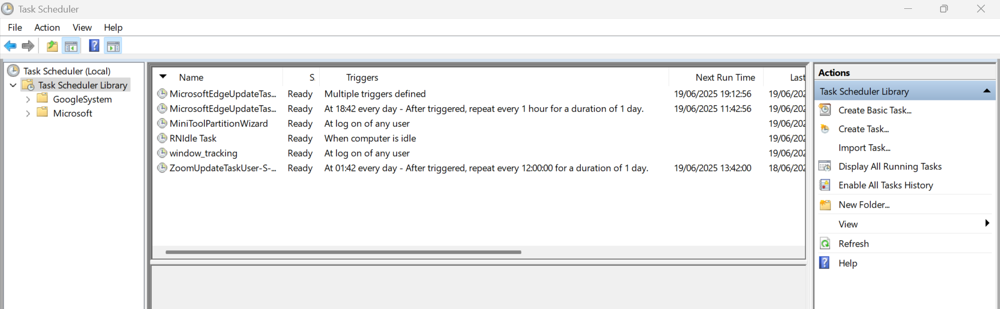
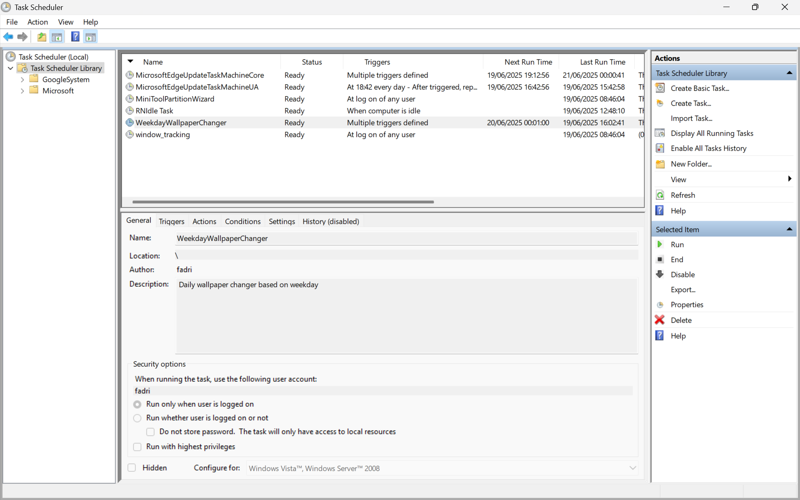
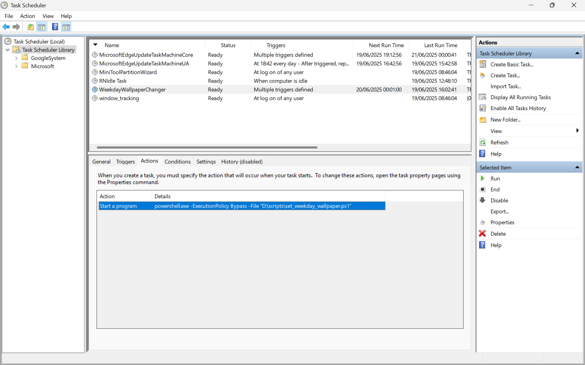
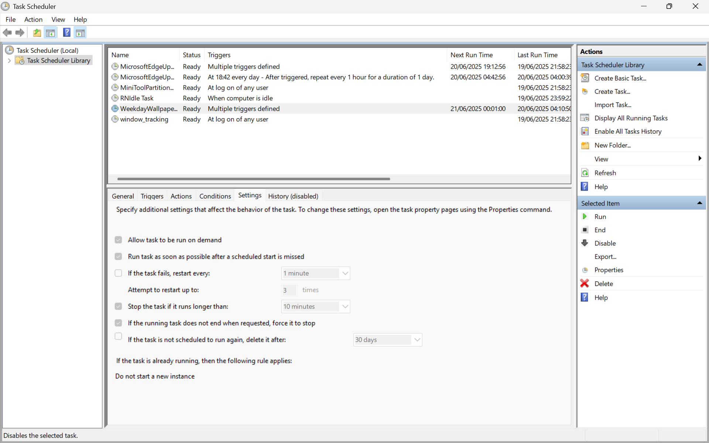
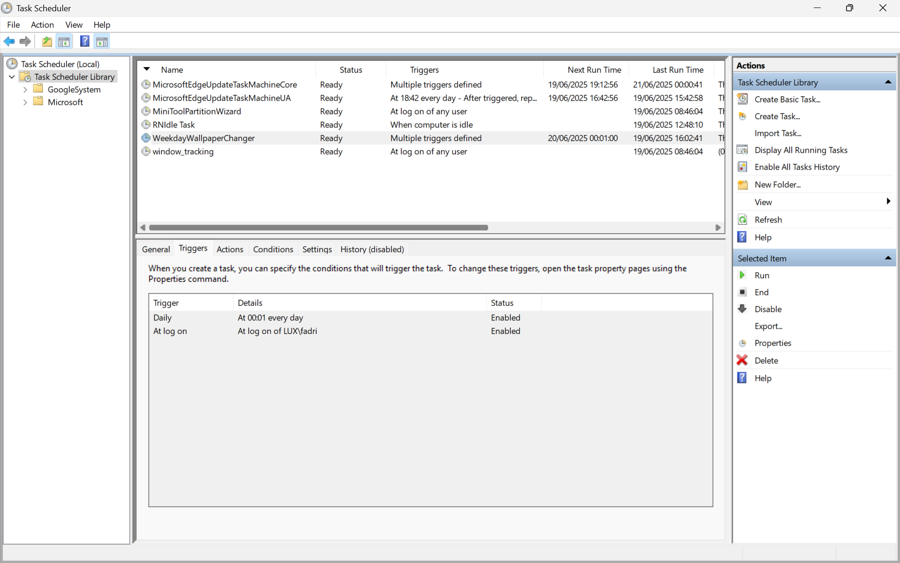
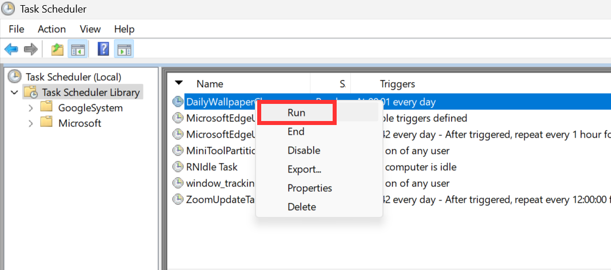
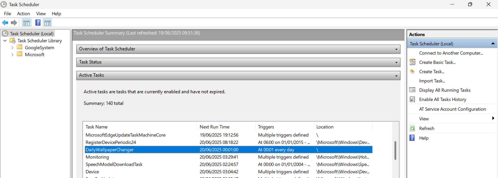
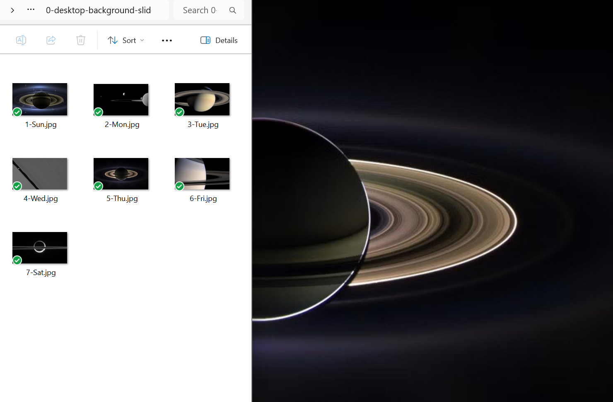

# Weekday Wallpaper Changer for Windows 11

Ever wondered what day it is? 

What if your screen could tell you WITHOUT words - simply by showing you one of your favorite background images? 

Introducing the WeekdayWallpaperChanger! 

This intuitive tool guides you to setup an automatically changing background according to each weekday using a predefined set of 7 images. 

## Table of Contents

- [Features](#-features)
- [Image File Setup](#️-image-file-setup)
- [Installation](#️-installation)
- [Task Scheduler](#-task-scheduler)
- [Manual Testing](#-manual-testing)
- [Building from Source](#-building-from-source)


## 🚀 Features

1. ### Graphical Folder Selection
   - **Intuitive GUI** dialogs to pick image and script locations either by mouse or copy-paste your path.

2. ### Wallpaper Display Mode Selection
   - Choose how wallpaper images are displayed on your monitors:
     - **Stretch**: Distorts image to fill screen exactly (no black bars)
     - **Fill**: Crops image while maintaining aspect ratio (no black bars)
     - **Fit**: Shows entire image (may have black bars)
     - **Center**: Original size centered (may have black bars)
     - **Span**: Spans image across all monitors as one continuous image

3. ### Multi-Format Image Support
   - Supports JPG, JPEG, PNG, BMP, GIF, TIFF, WEBP formats
   - Automatically detects file extensions for each weekday

4. ### Flexible Script Installation
   - Installer copies and patches the script for you; destination folder is user-chosen.

5. ### Automatic Path Patching
   - The installer automatically updates image paths and wallpaper style settings in your script.

6. ### Advanced Task Scheduler Automation
   - Sets up scheduled task with both daily (midnight) and logon triggers
   - XML-based configuration for better control and reliability

7. ### Windows 11 Slideshow Conflict Resolution
   - Multiple methods to ensure wallpaper changes work properly
   - Disables slideshow mode and forces picture mode

8. ### Error Handling and Cleanup
   - Clear error messages, uninstall option included.

## 🖼️ Image File Setup

Place 7 images in a folder of your choice with these exact names:

- `1-Sun` (Sunday)
- `2-Mon` (Monday) 
- `3-Tue` (Tuesday)
- `4-Wed` (Wednesday)
- `5-Thu` (Thursday)
- `6-Fri` (Friday)
- `7-Sat` (Saturday)

**Supported image formats:** JPG, JPEG, PNG, BMP, GIF, TIFF, WEBP

**Examples:**
- `1-Sun.jpg`, `2-Mon.png`, `3-Tue.webp`, `4-Wed.bmp`, etc.
- You can mix formats: `1-Sun.jpg`, `2-Mon.png`, `3-Tue.webp`

The script will automatically detect the file extension for each weekday image.

## 🛠️ Installation

### Quick Start - Two Easy Ways to Install

**Option 1: Executable (Recommended for Beginners)**
1. Download the `WeekdayWallpaperChanger_UnInstaller.exe` file
2. Double-click the file to run it
3. Follow the on-screen prompts to complete installation or uninstallation

**Option 2: PowerShell Script (For Users Who Want to Review Code)**
1. Download the `WeekdayWallpaperChanger_UnInstaller.ps1` file
2. Right-click the file and select "Run as administrator"
3. Follow the on-screen prompts to complete installation or uninstallation

Both options will guide you through the same process - the only difference is how you start the installer. 

The same file can be used for both installation and uninstallation.


### GUI Steps
During the installatio you will be asked to:
1. **Select Image Folder**: Choose the folder containing your 7 weekday images
2. **Select Script Location**: Choose where to install the wallpaper script (e.g., `C:\Scripts`)
3. **Choose Display Mode**: Select how wallpaper should be displayed on your monitors

### Automatic Setup

The installer will:
1. Copy and configure the wallpaper script
2. Create a Task Scheduler entry with daily and logon triggers
3. Test the installation

## 📅 Task Scheduler

The installer creates a scheduled task named **"WeekdayWallpaperChanger"** with:

- **Daily Trigger**: Runs at 12:01 AM every day
- **Logon Trigger**: Runs when you log in
- **Settings**: 
  - Runs whether user is logged on or not
  - Does not store passwords
  - Runs with highest privileges
  - Can be triggered manually

### Before Installation


### After Installation


**Actions Tab:**


**Settings Tab:**


**Daily Trigger Settings:**


## 🔧 Manual Testing

### Via Task Scheduler GUI
1. Open Task Scheduler (`taskschd.msc`)
2. Find "WeekdayWallpaperChanger" in the task list
3. Right-click and select "Run"



### Via Command Line
```powershell
# Run the scheduled task manually
schtasks.exe /Run /TN "WeekdayWallpaperChanger"

# Check active tasks
schtasks.exe /Query /TN "WeekdayWallpaperChanger"
```



### Direct Script Execution
```powershell
# Run the wallpaper script directly
PowerShell.exe -ExecutionPolicy Bypass -File "C:\Scripts\set_weekday_wallpaper.ps1"

# Test with specific image
PowerShell.exe -ExecutionPolicy Bypass -File "C:\Scripts\set_weekday_wallpaper.ps1" -ImagePath "C:\Images\1-Sun.jpg"
```

### Example Output



## 📦 Building from Source

Here is the workflow to build from source (i.e. convert .ps1 into .exe using .ico). 

### Install PS2EXE Module
```powershell
Install-Module ps2exe -Scope CurrentUser -Force
```

### Convert to EXE
```powershell
Invoke-ps2exe -inputFile "WeekdayWallpaperChanger_UnInstaller.ps1" -outputFile "WeekdayWallpaperChanger.exe" -iconFile "pics\ico\WeekdayWallpaperChanger.ico" -noConsole
```

### Development Workflow
```powershell
# Edit script, then convert and test
Invoke-ps2exe -inputFile "WeekdayWallpaperChanger_UnInstaller.ps1" -outputFile "WeekdayWallpaperChanger.exe" -iconFile "pics\ico\WeekdayWallpaperChanger.ico" -noConsole; .\WeekdayWallpaperChanger.exe
```

---

**Note**: This tool is designed for Windows 11 and uses advanced wallpaper setting methods to handle slideshow conflicts and multi-monitor setups.
